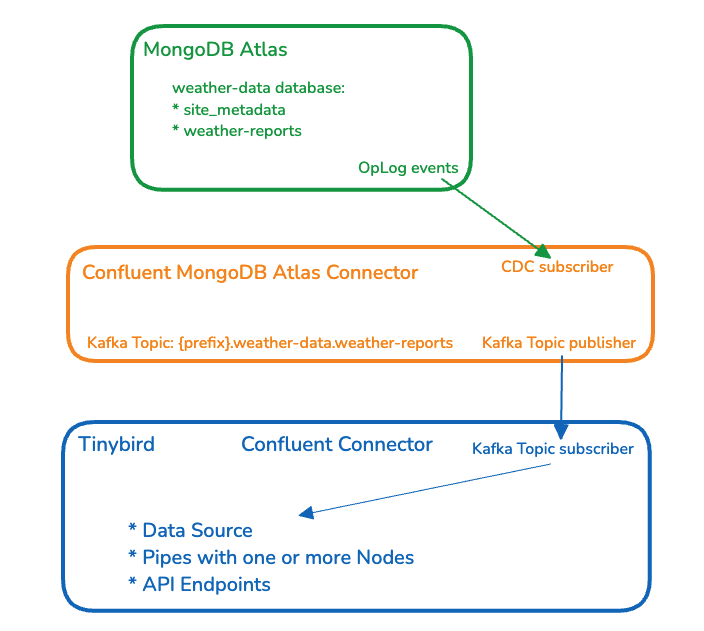
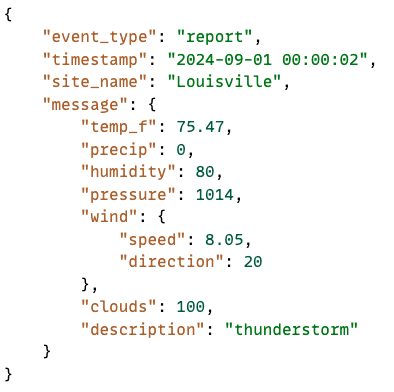
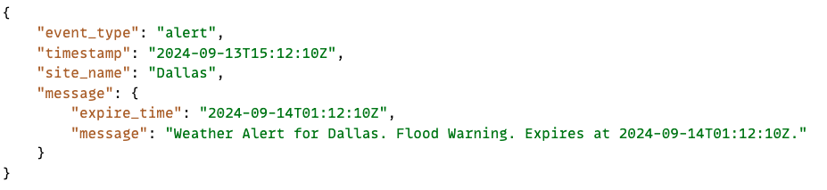
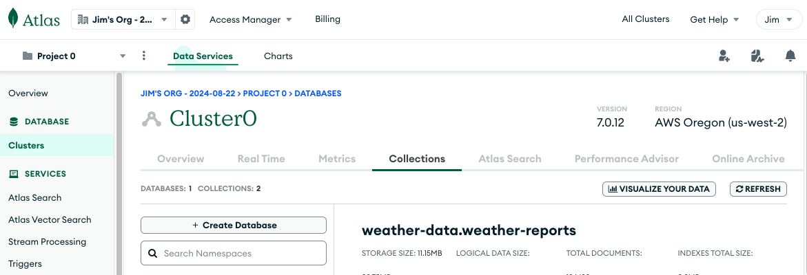
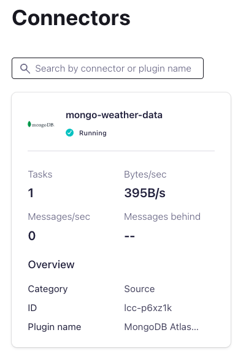

# Tinybird Workshop on ingesting MongoDB CDC events

This repository is a companion piece to the 'MongoDB CDC' workshop. The intended audience of this workshop are folks who have MongoDB data and are interested in streaming that data to Tinybird.

In this workshop we start with a MongoDB Atlas instance with a `weather-reports` collection in a `weather-data` database. We then configure and deploy an instance of the [Confluent MongoDB Atlas Source Connector](https://docs.confluent.io/cloud/current/connectors/cc-mongo-db-source.html), and then stream that data into Tinybird using its native Confluent Stream connector. 

Here is a look at what we are building:

## Workshop topics

* Publishing MongoDB data to a Kafka stream:
  * Tour live MongoDB collection on Atlas.
  * Confluent MongoDB Atlas Source Connector
* Consume Kafka Topic in Tinybird.
* Manage duplicate data.
* Working with nested and varying JSON documents
* Build API endpoints that publish MongoDB data.

The `tinybird` folder contains:
* Data Source definitions.
* Pipe and Node definitions.
* Example Tinybird Playgrounds.

## Resources
* [A practical guide to real-time CDC with MongoDB](https://www.tinybird.co/blog-posts/mongodb-cdc)
* [Lambda CDC processing with Tinybird](https://www.tinybird.co/docs/guides/querying-data/lambda-example-cdc)

## Session JSON objects

When working with nested JSON, there are two JSON documents ingested:

### Weather report objects

### Alert objects

This workshop starts with a MongoDB Atlas database with a `weather-reports` collection. 

The Confluent MongoDB Atlas Source Connector is used to publish CDC events onto a Kafka stream.

